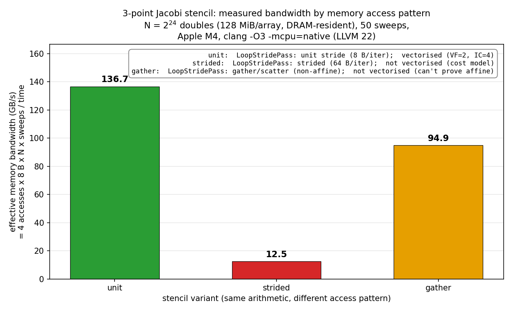
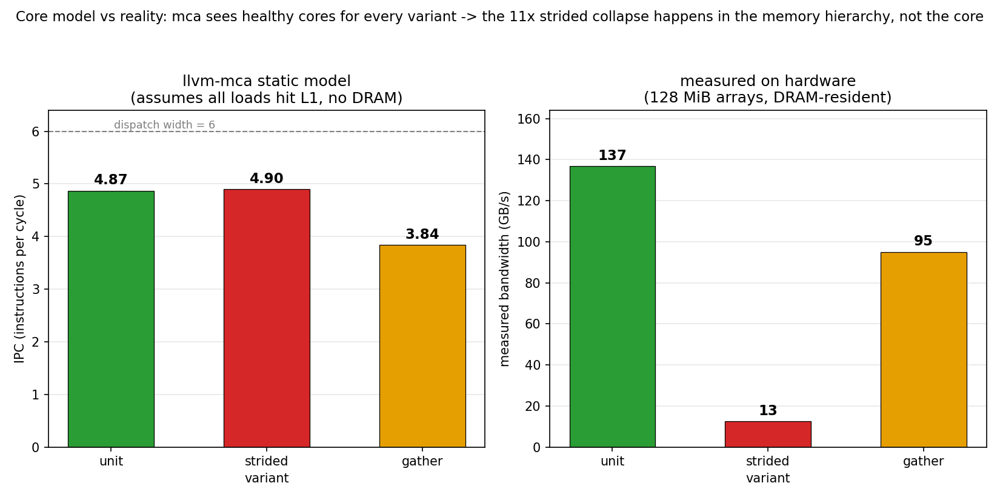

# llvm_pass_profiling


Can you tell whether a loop will be slow **before running it**? An out-of-tree LLVM analysis pass reads
the compiler's own intermediate representation, classifies every load and store by its memory stride,
and predicts vectorisability — then three independent instruments check whether the prediction holds.

| Level | Instrument | What it sees |
|---|---|---|
| Static, from IR | [`LoopStridePass`](pass/LoopStridePass.cpp) — custom | Stride of every access, via ScalarEvolution add-recurrences |
| Static, from the compiler | `clang -Rpass=loop-vectorize` | What the vectoriser decided, and why |
| Static, core model | `llvm-mca` | Cycles per iteration assuming everything is in L1 |
| Dynamic | wall clock + achieved GB/s | What actually happened |

## Result

3-point Jacobi stencil, `out[i] = 0.25·in[i-1] + 0.5·in[i] + 0.25·in[i+1]`, 2²⁴ doubles = 128 MiB per
array — far larger than any cache, so the numbers are DRAM bandwidth, not cache bandwidth.

| Variant | Pass verdict | Vectoriser | llvm-mca | Measured |
|---|---|---|---:|---:|
| **unit** | 3/3 unit-stride → contiguous | vectorised, VF=2 IC=4 | 11.3 cyc | **136.7 GB/s** |
| **strided** | 4/4 affine, 0/4 unit-stride | "not beneficial", interleaved ×4 | 89.0 cyc | **12.5 GB/s** |
| **gather** | contains gather/scatter | not vectorised | 14.0 cyc | **94.9 GB/s** |

All three compute the same checksum (`8389146.60468194`) — they do identical arithmetic on identical
data, so every difference is access pattern alone.



**The experiment's one trick: the gather uses an identity permutation.**

`idx[i] = i`, so at runtime the gather touches memory in *exactly* the same order as the unit-stride
version. The hardware prefetcher sees a sequential stream; the caches behave identically. The only
thing that changed is **what the compiler can prove**.

→ So the 136.7 → 94.9 GB/s gap is **pure lost vectorisation, with cache behaviour held constant** — a
separation you cannot get from profiling alone. That 30% is the *floor* cost of compiler opacity. A
random permutation would pay this *plus* the cache penalty.

**Strided is 11× slower, and that's memory, not the core.**

A 64-byte stride touches a fresh cache line per element and uses 8 of its 64 bytes. Note the instrument
disagreement: `llvm-mca` says only ~8× worse per block, because it models an ideal L1-resident core and
has no concept of DRAM. **The gap between the model and the measurement is where the damage is** — that
is what makes running both worthwhile.

Also note the vectoriser's exact wording: *legal* but "cost-model indicates that vectorization is not
beneficial". Interleaving still happened (4 scalar iterations in flight). Legality and profitability
are different decisions.



## How the pass works

`ScalarEvolution` expresses a loop-varying value as an add-recurrence `{base, +, step}<loop>`. If a
pointer has that form, it provably advances by `step` bytes per iteration.

| SCEV form | Classification | Consequence |
|---|---|---|
| `SCEVAddRecExpr` in this loop, constant step = element size | **unit stride** | Contiguous, cheap vector loads |
| `SCEVAddRecExpr`, constant step ≠ element size | **strided** | Needs interleaving; poor cache-line utilisation |
| `SCEVAddRecExpr`, symbolic step | affine, stride unknown | Vectoriser needs a runtime check |
| Loop-invariant | same address each iteration | — |
| Neither | **gather/scatter** | Address depends on loaded data; no closed form exists |

Two implementation points that matter:

- **Only the innermost owning loop counts.** `L->getBlocks()` on an outer loop includes its children's
  blocks, so without an `LI.getLoopFor(BB) != L` filter every access is reported once per nesting
  level. Stride with respect to the innermost loop is what sets cache behaviour.
- **The pass hooks `OptimizerEarly`.** It needs the IR after `mem2reg` and loop rotation — otherwise
  every local is stack traffic and there are no clean induction variables — but *before* the vectoriser
  and unroller, or the report describes transformed code rather than yours.

An incidental demonstration that this placement is right: the pass reports the strided loop **8 times**.
`STRIDE` is a compile-time constant, so clang fully unrolled the outer pass-loop during simplification.
The pass sees the real post-simplification IR, not the source's fiction.

## Build

Needs an LLVM installation with development headers. No LLVM rebuild required — this is a plugin.

```bash
./scripts/build_pass.sh        # pins LLVM via `llvm-config --cmakedir`
```

Three build details that are easy to get wrong:

| Detail | Why |
|---|---|
| `-fno-rtti` | LLVM is built without RTTI. A plugin compiled *with* it references `typeinfo` symbols LLVM never emitted → unresolved symbols at load |
| `project(... C CXX)` | LLVM's config probes libedit with a **C** `check_include_file`; a CXX-only project fails at configure time |
| macOS `-undefined dynamic_lookup` | `MODULE` libraries error on undefined symbols by default; deferring resolution lets the plugin bind against whichever host loads it |

The plugin header moved from `llvm/Passes/` to `llvm/Plugins/` in LLVM 22, so the source guards it with
`__has_include`. LLVM's C++ API has no stability guarantee across major versions — out-of-tree passes
chase that churn permanently.

## Run

```bash
./scripts/stride.sh      # the custom pass      -> benchmarks/stride_report.txt
./scripts/remarks.sh     # vectoriser remarks   -> benchmarks/vectorize_remarks.txt + opt-record YAML
./scripts/mca.sh         # static core model    -> benchmarks/mca_report.txt
./scripts/perf.sh        # hardware counters    (Linux only)
python3 scripts/plots.py # figures              -> benchmarks/*.png
```

`remarks.sh` also emits `-fsave-optimization-record` YAML, which `opt-viewer.py` renders as annotated
source. That is the form that scales to a large codebase — grepping remark spam does not.

## Limitations

| Limitation | Detail |
|---|---|
| **Innermost stride only** | A column walk over a row-major 2-D array reports as "strided" without identifying which outer loop would fix it. Loop interchange detection is out of scope |
| **Structural verdict, no cost model** | "Hard to vectorise" is a heuristic, not a theorem — AVX-512 and SVE have hardware gathers |
| **Symbolic strides detected but not bounded** | `A[i*n]` is flagged affine-with-unknown-step; the vectoriser does better with runtime checks |
| **`llvm-mca` assumes L1 residency** | Its numbers are only meaningful comparatively, and alongside a bandwidth measurement |
| **Single-threaded by design** | Adding OpenMP would mix bandwidth saturation into what is a code-generation story |
| **Measured on Apple M-series** | LLVM 22, `-O3 -mcpu=native`, NEON. VF=2 is 128-bit vectors; AVX-512 would choose differently, and has gathers |

## Layout

```
pass/LoopStridePass.cpp   the analysis pass — SCEV add-rec classification, two PassBuilder hooks
pass/CMakeLists.txt       config-mode LLVM, -fno-rtti, macOS dynamic_lookup
kernel/stencil.c          three variants: unit, strided, gather (identity permutation)
scripts/                  build_pass, stride, remarks, mca, perf, plots
benchmarks/               captured reports and figures
```

The optimisation-record YAML and `perf.data` are regenerable and not committed.
